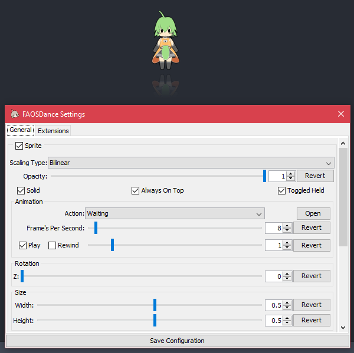

# FAOSDance [](https://github.com/DeflatedPickle/FAOSDance/commits/master) [](https://travis-ci.org/DeflatedPickle/FAOSDance) [](https://codeclimate.com/github/DeflatedPickle/FAOSDance/maintainability)
A stand-alone, free and open-source and extendable implementation of the Fruity Dance plugin from FL Studio.

## Table Of Contents
- [Comparison With Fruity Dance](#comparison-with-fruity-dance)
- [Basic Usage](#basic-usage)
    - [Setting Up](#setting-up)
    - [Running On Start-Up](#running-on-start-up)
- [Using The Config](#using-the-config)
    - [Config Options](#config-options)
    - [Config Examples](#config-examples)
- [Extending The Program](#extending-the-program)
    - [Using Scripts](#using-scripts)
    - [Writing Scripts](#writing-scripts)
- [Finding Your App Data Directory](#finding-your-app-data-directory)

| | Downloads |
|---|---|
| **Latest** | [](https://github.com/DeflatedPickle/FAOSDance/releases/tag/v0.27.1-alpha) |
| | [](https://github.com/DeflatedPickle/FAOSDance/releases/tag/v0.17.2-alpha) |
| | [](https://github.com/DeflatedPickle/FAOSDance/releases/tag/v0.13.0-alpha) |
| | [](https://github.com/DeflatedPickle/FAOSDance/releases/tag/v0.9.3-alpha) |
| | [](https://github.com/DeflatedPickle/FAOSDance/releases/tag/v0.4.1-alpha) |
| | [](https://github.com/DeflatedPickle/FAOSDance/releases/tag/v0.2.1-alpha) |
| | [](https://github.com/DeflatedPickle/FAOSDance/releases/tag/v0.1.0-alpha) |

---

## Comparison With Fruity Dance
| | Fruity Dance (Official Plugin for FL Studio) | FAOSDance (This Program) |
|---|---|---|
| **Interface** |  |  |
| **Pros** | Ships with a top of the ~~Image~~ line DAW | Free, stand-alone and more customizable, has a config file, completely scriptable |
| **Cons** | Requires owning (paid or trial) and running FL Studio | *Cons Coming Soon* |

---

## Basic Usage
### Setting Up
- Download the JAR from the [latest release](https://github.com/DeflatedPickle/FAOSDance/releases/latest)
- Download the FL-Chan (or similar) sprite sheet and text file (can be found in the FL Studio files, or you can [download a big version](http://www.image-line.com/support/FLHelp/content/FLChan_HD.zip))
- Run the program
    - Click the big "Open" button
        - Locate the FL-Chan (or similar) sprite sheet and text file
            - Double-click either one, or click it and then click "Open"

### Running On Start-Up
If you want to run the program on start-up, you can using a couple scripts. These will find the latest version of the program in a directory and run it.
It's a good idea to add a config, so it starts up without a prompt window.
- Download the files in the `scripts` folder
    - Place `FAOSDance.ps1` in the same directory as you put `FAOSDance.jar` in
    - Place `FAOSDance.bat` in `C:\ProgramData\Microsoft\Windows\Start Menu\Programs\Startup`
- Open `FAOSDance.bat` and change `./FAOSDance.ps1` to the full path of where you put `FAOSDance.ps1`

## Using The Config
The easiest way to use the config is to change your settings in the UI and then click the "`Save Configuration`" button. But if you want to edit the raw config as text, or share it, find your data directory using [Finding Your App Data Directory](#finding-your-app-data-directory), then open the "`config.toml`" file.

### Config Options
| Option | Description |
|---|---|
| `sprite.sheet` | `(String)` The path to the sprite sheet name to use, without any extensions |
| `sprite.action` | `(String)` The action to start play through |
| `sprite.fps` | `(Integer)` The amount of delay between each frame |
| `sprite.opacity` | `(Double)` The opacity of the sprite
| `sprite.visible` | `(Boolean)` Whether or not the sprite is visible |
| `sprite.solid` | `(Boolean)` Whether or not the sprite can be clicked and dragged |
| `sprite.always_on_top` | `(Boolean)` Whether or not the program stays above other windows |
| `sprite.scaling_type` | `(Enum)` The kind of scaling used for the sprite |
| `animation.play` | `(Boolean)` Whether or not the animation is playing |
| `animation.rewind` | `(Boolean)` Whether or not the animation is playing backwards |
| `animation.frame` | `(Integer)` The current frame of animation |
| `location.x` | `(Integer)` The location of the window along the X axis |
| `location.y` | `(Integer)` The location of the window along the Y axis |
| `rotation.z` | `(Integer)` The rotation of the sprite |
| `size.width` | `(Double)` The width of the sprite |
| `size.height` | `(Double)` The height of the sprite |
| `reflection.visible` | `(Boolean)` Whether or not the reflection is visible |
| `reflection.padding` | `(Double)` The amount of padding (centered) between the sprite and the reflection |
| `reflection.fade.height` | `(Double)` The amount of the reflection hidden, from the bottom up |
| `reflection.fade.opacity` | `(Double)` The opacity of the reflection |
| `extensions.enabled` | `(List (String))` A list of extension names to be enabled |
### Config Examples
```toml
[sprite]
sheet="path/to/file/without/extensions"
action="Zitabata"
fps=26

[size]
width=1.0
height=1.0

[reflection]
visible=false
```
```toml
[sprite]
sheet="path/to/file/without/extensions"
action="Held"
opacity=0.94

[size]
width=1.0
height=1.0

[reflection]
visible=false

[extensions]
enabled=["Spin"]
```

## Extending The Program
The program can be extended with scripts written in the Ruby language. The scripts can be found in the settings UI under their own tab, where information and settings for each script can be found.
### Using Scripts
***Warning: Scripts can run any arbitrary code, always check scripts before using them!***

To add new scripts, you'll need to follow [Finding Your App Data Directory](#finding-your-app-data-directory), then put the scripts in the "`scripts`" directory.
### Writing Scripts
To begin writing scripts, you should probably have a basic understanding of the [Ruby language](https://www.ruby-lang.org/en/), [Swing](https://en.wikipedia.org/wiki/Swing_(Java) (specifically the `Graphics2D` class) and object-oriented programming.

Beyond that, here are some general steps to set up a script:
- Make a new file in the `scripts` directory
- Open it in a text editor or IDE
- Make a new class that extends `DanceExtension`
- Add an `initialize` method and call `super` with the `name`, `description` and `author` of your script
- Override the `enable` and `disable` methods to add logic to get/reset the script values when the script is enabled/disabled
- If you want settings, override the `settings` method and add your widgets
- Pick your [entry point/s](https://github.com/DeflatedPickle/FAOSDance/blob/master/src/main/resources/scripts/dance_extension.rb)
    - Override the methods for them
        - Implement your logic
- Use `FAOSDance.registerExtension` to register a new instance of your class

If you get stuck, there are some example scripts [here](https://github.com/DeflatedPickle/FAOSDance/tree/master/src/main/resources/scripts).

## Finding Your App Data Directory
### Windows
The easiest way to find this directory by typing "`%APPDATA%`" into the File Manager or search bar.
### Linux
#### GUI (Nautilus and forks)
First, open your file manager if it isn't already, then show hidden files from the View menu. Then go to home, and `.config`.
#### Terminal
First, fire up your terminal if it isn't already, then type; "`cd ~/.config`". If your terminal doesn't support tilde notation, then type this instead; "`cd $HOME/.config`".